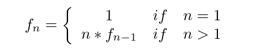

#关于SICP的SICP

### 1. 浅谈递归和迭代
####什么是递归？
我们先从一个简单的例子说起，数学里阶乘是这样定义的：

> 

根据定义可以写出阶乘的scheme代码
>(define (fac n)
    (if (= n 1) 1 (* n (f (- n 1)))))

实在写出下不了，上面全是废话，其实，要想理解递归，***多动手，多动脑***。

递归与迭代本质上是计算过程的不同，实现某一计算，递归往往需要更多的空间和时间，这往往是由于递归本身的原因造成的，递归程序需要保存中间计算状态，树形递归会导致重复计算，而线性递归与迭代相比，需要更多的空间。线性递归开始采取正则序求值，到达基础条件时才开始求值。

